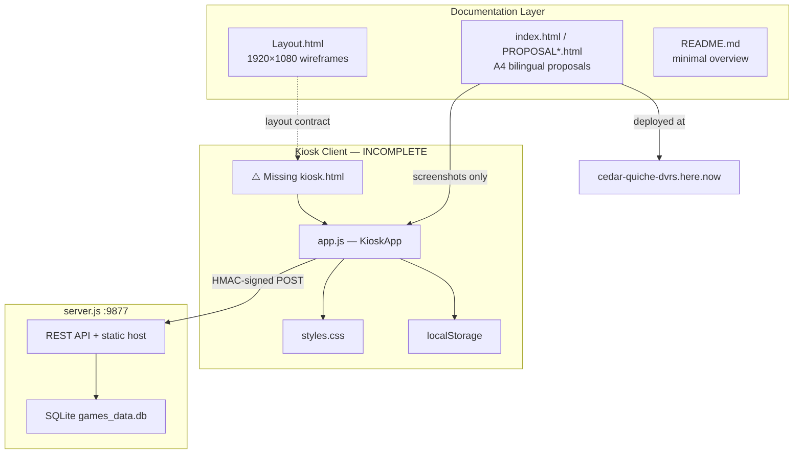

# Bahrain Youth City Games — Deep Recon

> Cross-reference of the entire repository against its proposal documentation (`PROPOSAL.html`, `index.html`, `README.md`, `Layout.html`).

## Executive Summary

This repository contains **two parallel tracks** that are not yet integrated:

1. **Proposal layer** (complete, deployed) — polished bilingual A4 sales documents with game screenshots, PDF export, dark/light theme toggle. Live at [https://cedar-quiche-dvrs.here.now/](https://cedar-quiche-dvrs.here.now/).
2. **Game stack** (logic complete, shell missing) — ~1,116 lines of `app.js` game logic, 341 lines of kiosk CSS, and a tested Express/SQLite backend. **No HTML file loads the games.**

The backend passes all 10 integration tests. The proposal reads as a finished product. The runnable kiosk platform does not exist as a single deployable entry point.

**Overall alignment with documented deliverables: ~40% implemented, ~35% partial, ~25% missing or contradicting.**

---

## The Territory

### What the documentation promises

The proposal (`PROPOSAL.html`, mirrored in Arabic as `index.html`) describes an **Interactive Educational Games Platform** for Bahrain Youth City:

| Dimension | Documented commitment |
|-----------|----------------------|
| Investment | BD 1,200 (3 × BD 400 per game) |
| Games | Spot the Difference, National Values Memory, Landmark Mapping |
| Visuals | High-fidelity **3D scenes**, GulfMarcom photography, realistic **3D Bahrain map** |
| Platform | Bilingual AR/EN with RTL, kiosk/tablet/desktop, WCAG 2.1 AA |
| Performance | Under 2s load, 60fps, low resource use |
| Scoring | Persistent scores on host device |
| Support | 6 months post-delivery |
| Delivery | 20 days from advance payment |

Game-specific specs from the proposal:

**Game 1 — Spot the Difference (لعبة ركز)**
- Two side-by-side 3D landmark scenes with one photographic difference
- 5 landmarks: Al-Fateh Mosque, Bahrain Fort, Bahrain Gate, F1 Circuit, King Fahd Causeway
- Easy: 60s / 100 pts per round; Hard: 45s / 150 pts
- Educational modal after each round; persistent leaderboard

**Game 2 — National Values Memory (بطاقات القيم)**
- 6 national values (also states 8 pairs / 16 cards — internally contradictory)
- 5-second face-up preview, then flip
- 60s timer, live session leaderboard
- GulfMarcom-designed card images with AR/EN labels

**Game 3 — Landmark Mapping (معالم بحريننا)**
- Realistic interactive 3D map with ocean, lighting, shadows
- Drag-and-drop chips to geographic positions
- Easy: 3 landmarks × 100 pts; Hard: 5 × 150 pts; 120s timer
- Educational facts on correct placement

### What the codebase actually contains

```
bahrain-youth-city-games/
├── PROPOSAL LAYER (runnable, deployed)
│   ├── index.html          ← Arabic proposal (= PROPOSAL_ar.html), deployed entry
│   ├── PROPOSAL.html       ← English proposal
│   ├── PROPOSAL_*_light.html
│   └── *.pdf               ← Generated exports
│
├── GAME STACK (orphaned — no HTML shell)
│   ├── app.js              ← KioskApp: 3 games, audio, keyboard, API client
│   ├── styles.css          ← 1920×1080 kiosk visual system
│   └── (missing kiosk.html)
│
├── BACKEND (runnable, tested)
│   ├── server.js           ← Express :9877, static host + REST API
│   ├── games_data.db       ← leaderboard + telemetry tables
│   └── test_backend.js     ← 10/10 tests passing
│
└── DESIGN ARTIFACTS
    ├── Layout.html         ← 1920×1080 wireframes (static)
    └── PROPOSAL_backup.html ← Earlier Tailwind sales doc (evolution snapshot)
```

### Runnable today

```bash
npm install && npm start   # → http://localhost:9877 (serves proposals + API)
npm test                   # → 10/10 backend tests pass (server must be running)
```

Opening `http://localhost:9877/` serves the **Arabic proposal**, not the games.

---

## Documentation vs Implementation Matrix

### Game 1 — Spot the Difference

| Deliverable | Status | Notes |
|-------------|--------|-------|
| Two 3D scenes side by side | **MISSING** | Same PNG on both panels; difference is a programmatic red dot |
| One hidden photographic difference | **PARTIAL** | Overlay hotspot, not GulfMarcom photo diff |
| 5 Bahrain landmarks | **PARTIAL** | 5 landmarks present; "Bahrain Gate" → Bab Al Bahrain |
| Easy 60s / Hard 45s timers | **IMPLEMENTED** | `app.js` L337 |
| 100 / 150 pts per round | **IMPLEMENTED** | `app.js` L465 |
| Educational modal per round | **IMPLEMENTED** | `showEducationalModal()` |
| Persistent score tracking | **IMPLEMENTED** | localStorage + SQLite API |
| Bilingual AR/EN RTL | **PARTIAL** | Logic exists; no runnable UI |
| GulfMarcom assets | **PARTIAL** | `G1_Rakkiz.png` reused for 4/5 landmarks |
| Kiosk touch optimization | **PARTIAL** | Touch handlers exist; fixed 1920×1080 only |

### Game 2 — National Values Memory

| Deliverable | Status | Notes |
|-------------|--------|-------|
| 6 national values | **CONTRADICTS** | Proposal says both 6 values AND 8 pairs; code has 8 values |
| 4×4 grid, 16 cards | **IMPLEMENTED** | 8 values × 2 |
| 5s face-up preview | **IMPLEMENTED** | 5000ms timeout |
| 60s timer | **IMPLEMENTED** | |
| Live pair counter | **MISSING** | `matchesFound` tracked but not displayed |
| Live session leaderboard | **PARTIAL** | Static load at init; mock data fallback; no polling |
| GulfMarcom card images | **MISSING** | Lucide icons only, `G2_Memory.png` unused |
| Animated card flip | **IMPLEMENTED** | CSS 3D flip in `styles.css` |
| Bilingual labels | **PARTIAL** | Per-card AR/EN spans in generated HTML |

### Game 3 — Landmark Mapping

| Deliverable | Status | Notes |
|-------------|--------|-------|
| Realistic 3D Bahrain map | **MISSING** | 2D drop zones; `G3_Explore.png` on disk but unused |
| 3D perspective, ocean, lighting | **MISSING** | CSS pins and dropzones only |
| Drag-and-drop placement | **IMPLEMENTED** | Pointer events, touch-optimized |
| Easy 3 / Hard 5 landmarks | **IMPLEMENTED** | |
| 100 / 150 pts per placement | **IMPLEMENTED** | |
| 120s timer | **IMPLEMENTED** | |
| Educational facts | **PARTIAL** | **Bug:** ID mismatch (`fort` vs `bahrain_fort`) → wrong facts shown |
| Gold pin on correct placement | **PARTIAL** | Pin renders; no dropzone flash on error |

### Platform specs (Page 5)

| Spec | Status | Notes |
|------|--------|-------|
| Bilingual AR/EN, RTL | **PARTIAL** | `toggleLanguage()` in JS; no kiosk HTML |
| Kiosk / tablet / desktop | **PARTIAL** | Fixed 1920×1080 lock; not responsive |
| Real-time 3D graphics | **MISSING** | No WebGL/Three.js |
| Under 2s load, 60fps | **MISSING** | No performance instrumentation |
| Persistent scoring | **PARTIAL** | Leaderboard yes; no session history UI |
| WCAG 2.1 AA | **MISSING** | No ARIA, `alert()`/`confirm()`, no screen reader support |

### Backend & security

| Capability | Status | Notes |
|------------|--------|-------|
| `GET /api/leaderboard` | **IMPLEMENTED** | Tested |
| `POST /api/scores` + HMAC | **IMPLEMENTED** | Tested |
| `POST /api/telemetry` | **PARTIAL** | Server ready; **client never calls it** |
| Score bounds validation | **MISSING** | Signature only; no max-score checks |
| Client-side `SECRET_KEY` | **CRITICAL** | Exposed in `app.js` — anti-tamper is cosmetic |
| Offline signature fallback | **CONTRADICTS** | Client sends `offline-*` prefix; server rejects |

---

## Architecture



### Score data flow

1. Player completes game → `handleGameOver(true)` adds speed bonus (`timeLeft × 3`)
2. Virtual keyboard captures name (max 12 chars, AR/EN layouts)
3. Client builds payload + HMAC-SHA256 signature
4. **Always** saves to `localStorage` first
5. Attempts `POST /api/scores` → server verifies HMAC → SQLite insert → returns rank
6. Leaderboard view tries API first, falls back to localStorage

---

## Tensions

### 1. Proposal promises 3D; implementation is 2D

The proposal repeatedly claims "high-fidelity 3D scenes," "realistic interactive 3D map," and "real-time 3D graphics with dynamic lighting." The implementation uses static PNGs, CSS overlays, and programmatic difference markers. The marketing screenshots (`game1_spot_difference.png`, etc.) depict a polished UI that may represent the *target* design rather than the current runnable state.

### 2. `index.html` is the proposal, not the product

`README.md` describes an "Interactive Kiosk Games Platform," but `index.html` — the deployed entry point — is byte-identical to the Arabic proposal (`PROPOSAL_ar.html`). A visitor to the live site or `npm start` sees a sales document, not playable games.

### 3. Game logic exists without a host page

`app.js` expects 7 screen sections (`screen-cover`, `screen-menu`, `screen-rakkiz`, `screen-memory`, `screen-mapping`, `screen-score-submit`, `screen-leaderboard`) and 25+ element IDs. `styles.css` defines kiosk styling. Neither is referenced by any HTML file. This is the single largest blocker.

### 4. Internal documentation contradictions

- Game 2: "six national values" vs "eight national value pairs" (proposal contradicts itself)
- Landmark naming: "Bahrain Gate" in proposal vs "Bab Al Bahrain" in code (likely the same landmark, different English label)
- Support: `PROPOSAL_backup.html` says 30 days; current proposal says 6 months
- Year: backup references "2030"; current says "June 2026"

### 5. Security model is broken by design

`SECRET_KEY = 'BahrainYouthCitySecret2026!'` is hardcoded in both `app.js` (client) and `server.js` (server). Anyone can inspect the client and forge valid score signatures. For a kiosk with local trust boundaries this may be acceptable; against the proposal's implied integrity guarantees, it is not.

### 6. Wireframes, code, and proposal are three divergent truths

| Source | Game 1 panels | Memory values | Mapping landmarks |
|--------|--------------|---------------|-------------------|
| `Layout.html` wireframe | 880×850 px | 4/8 pairs shown | 2/10 progress |
| `styles.css` | 800×600 px | 180×180 cards | 1100×700 map |
| `app.js` logic | 5 rounds | 8 pairs (16 cards) | 3 or 5 landmarks |

---

## What Works Well

Despite the gaps, substantial engineering is already in place:

- **Game mechanics** — timers, scoring, difficulty modes, educational modals, drag-drop, memory flip logic, miss penalties
- **Kiosk UX patterns** — virtual Arabic/English keyboard, touch/pointer events, context menu disabled, audio synth feedback
- **Offline resilience** — localStorage fallback when API unreachable; games playable without server
- **Backend quality** — clean REST API, HMAC validation (server-side), mock seed data, telemetry table, 10/10 tests
- **Proposal polish** — bilingual A4 layout, Sadu geometric borders, dark/light toggle, print-to-PDF, responsive breakpoints for proposal viewing
- **Bilingual content** — landmark facts, value names, UI strings in AR/EN with RTL switching logic

---

## Open Questions

1. **Was a kiosk HTML ever built?** Git history shows no deleted `kiosk.html` or `games.html`. Was it developed outside this repo, or is it still pending?
2. **Are the game screenshots the target UI?** `game1_spot_difference.png` etc. appear in proposals but don't match what `app.js` would render (Tailwind classes, Lucide icons).
3. **6 or 8 national values?** Which spec should the client receive? The 8-pair implementation is internally consistent; the "six values" line in the proposal may be outdated.
4. **Is 3D in scope for v1?** The backup proposal promised hardware-accelerated 3D; current code is a pragmatic 2D prototype. Is the 2D approach an acceptable delivery, or is 3D still required?
5. **GulfMarcom assets** — Are `G1_Rakkiz.png`, `G2_Memory.png`, `G3_Explore.png` the final assets, or placeholders awaiting integration?
6. **Deployment model** — Will kiosks run `npm start` locally, or static-only with localStorage? The hardcoded `API_URL = 'http://localhost:9877'` suggests local server assumption.

---

## Recommended Next Steps (Priority Order)

### Critical (blocks delivery)

1. **Create `kiosk.html`** — Wire all DOM IDs expected by `app.js`, load `styles.css`, Lucide CDN, Tailwind (or replace utility classes), and `app.js`
2. **Integrate GulfMarcom assets** — Use per-landmark images in Game 1, `G2_Memory.png` cards in Game 2, `G3_Explore.png` as map background in Game 3
3. **Fix mapping fact ID mismatch** — Align `MAPPING_LANDMARKS` IDs with `RAKKIZ_LANDMARKS` or create a shared landmark registry
4. **Resolve security model** — Remove `SECRET_KEY` from client; either accept kiosk-local trust (localStorage only) or implement server-side session tokens

### High (contract alignment)

5. Wire client telemetry (`game_start`, `game_complete`, `language_toggle`) to `/api/telemetry`
6. Add live pair counter to Game 2 UI
7. Decide and document 6 vs 8 national values; update proposal if needed
8. Make `API_URL` configurable via environment or relative path
9. Add real-time leaderboard refresh (polling on score submit)

### Medium (quality & accessibility)

10. WCAG pass — ARIA labels, focus management, replace `alert()`/`confirm()` with in-app modals
11. Responsive scaling below 1920×1080 for tablets
12. Expand `README.md` with setup, architecture, API docs, and file map
13. Document speed bonus scoring (undocumented `timeLeft × 3` bonus)

---

## File Reference

| File | Role | Runnable |
|------|------|----------|
| `index.html` | Arabic proposal (deployed) | Yes |
| `PROPOSAL.html` | English proposal | Yes |
| `app.js` | Game controller | No (no HTML host) |
| `styles.css` | Kiosk styles | No (no HTML host) |
| `server.js` | API + static server | Yes |
| `Layout.html` | UX wireframes | View only |
| `README.md` | Project overview | Incomplete |
| `test_backend.js` | API integration tests | Yes (needs server) |
| `generate_pdf.js` | Playwright PDF export | Manual |

---

> [!info] Process Log
> **Session:** 2026-06-19
> **Mode:** Autonomous deep recon
> **Agents dispatched:** Explorer, Critic, Associator (Round 1)
> **Backend tests:** 10/10 passing
> **Live deployment:** https://cedar-quiche-dvrs.here.now/ (proposal only)
> **Primary finding:** Game stack is built but not wired; proposal layer is complete and deployed